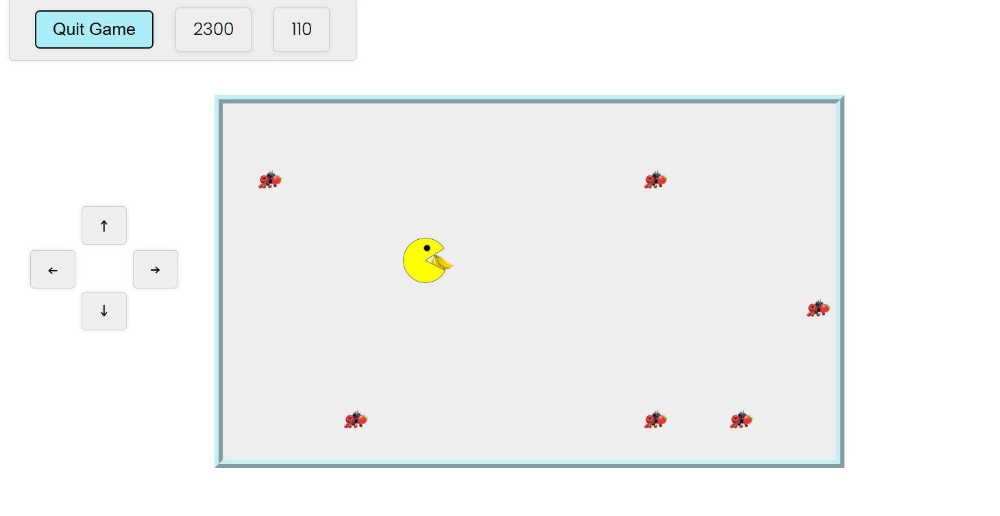

# Pacman Mini project

https://pacmanbis.netlify.app/

This is vanilla JS app. In the **HTML index file** we design the game layout, load the spounds and backgroung **Ukulele** and link the **pacman js file**. The pacman.js code dynamically update pacman position by assigning new coordinate, direction, orientation and image when necessary. Note that we implement **edge detection and fruits collision** as we update the pacman position. **CSS display property** is updated to none for a specific fruit each time the collision is detected. The **score** will then be updated by adding coresponding values; i.e different fruits carry different values. Recursion is used to update the pacman position every **0.15 sec** and **clearTimeout** method is invoked whenever necessary to avoid unexpected speed increase. **keydown event and listener** are used in combination with **specific keycodes** for controls. Simply press arrow key cahne direction or prss and hold to speed up towards the fruit of choice. A **146 sec countdown** is initiated when the game starts. More fruits will be added as you clear the existing ones. The **Start Game** button is dynamically changed to reflect the actual state and you can quit the game anytime by pressing the same button.
**Roadmap:Add touchscreen/screen controls functionality.**

Thank you for visiting this repository. Feedbacks are welcome and can be emailed to bishimwe84@gmail.com.

# PacMan Mini Project
